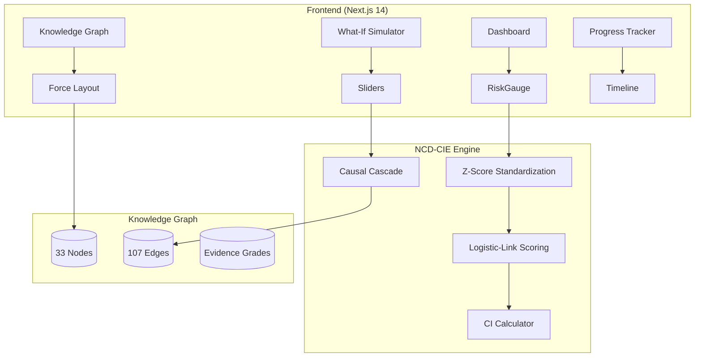

# 🏥 NCD Health+: Clinical Decision Support with Causal Knowledge Graphs

<div align="center">


[](https://nextjs.org)
[](https://typescriptlang.org)
[](https://tailwindcss.com)
[](https://recharts.org)
[](LICENSE)

Interactive web application for NCD risk prediction using evidence-based causal knowledge graphs.

[Paper](#-citation) · [Quick Start](#-quick-start) · [Architecture](#-architecture) · [Features](#-features)

</div>

---

## 📋 Overview

**NCD Health+** is the companion web application for the **NCD-CIE** (Non-Communicable Disease — Causal Inference Engine) paper, submitted to **AIiH 2026**. It provides clinicians and researchers with an interactive tool for predicting and visualizing NCD risk using a curated causal knowledge graph.

The system implements three core capabilities:

1. **Risk Scoring Engine** — Logistic-link model computing disease-specific risks with Z-score standardized inputs and 95% confidence intervals
2. **What-If Simulator** — Interactive intervention analysis with topological causal cascade propagation (γ=0.7 attenuation, max depth d=3)
3. **Knowledge Graph Viewer** — Force-directed visualization of all 107 evidence-graded causal relationships across 5 clinical domains

### Key Metrics

| Component | Value | Description |
|-----------|-------|-------------|
| **Causal Edges** | 107 | Evidence-graded relationships (A–D) |
| **Graph Nodes** | 33 | Biomarkers, diseases, lifestyle, medications, demographics |
| **Clinical Domains** | 5 | CVD, T2DM, CKD, Shared, Intervention |
| **Confidence Intervals** | 95% | Risk bounds using edge weight CIs |

---

## 📸 Features

### Dashboard
Real-time risk gauges displaying CVD, T2DM, and CKD probabilities alongside composite NCD score with 95% confidence intervals. Animated SVG visualizations provide intuitive risk communication.

### What-If Simulator
Interactive sliders enable clinicians to explore intervention scenarios. The causal cascade engine propagates changes through the knowledge graph, showing how modifying one biomarker affects downstream disease risks.

### Knowledge Graph Viewer
Force-directed network visualization of all 107 causal edges. Filter by domain, evidence grade, or node type. Hover interactions reveal edge weights and source references.

### Progress Tracker
Longitudinal timeline view tracking biomarker trends and clinical milestones across patient visits with localStorage persistence.

---

## 🚀 Quick Start

### Prerequisites
- Node.js 18+
- npm or pnpm

### Development

```bash
# Clone the repository
git clone https://github.com/Anirach/ncd-health-plus.git
cd ncd-health-plus

# Install dependencies
npm install

# Start development server
npm run dev

# Open the application
open http://localhost:3000
```

### Production Build

```bash
# Build static export
npm run build

# Serve the static build
npx serve out/
```

---

## 🏗 Architecture



---

## 🔬 Algorithms

### Z-Score Standardization
Biomarker values are normalized against population reference statistics:
```
z_i = (x_i - μ_i) / σ_i
```
Where μ and σ are population mean and standard deviation for biomarker i.

### Logistic-Link Risk Scoring
Disease-specific risk computed via logistic regression:
```
R_d = σ(β₀ + Σ W_ij · z_j)
```
Where:
- `σ(x) = 1 / (1 + e^(-x))` — Sigmoid function
- `β₀` — Disease-specific intercept
- `W_ij` — Edge weight from biomarker j to disease d
- `z_j` — Standardized biomarker value

### Composite NCD Risk
Aggregate risk across all three disease domains:
```
R_NCD = 1 − (1 − R_CVD)(1 − R_T2DM)(1 − R_CKD)
```

### What-If Cascade Algorithm
Intervention propagation through the causal graph:
```
Algorithm 1: Causal Cascade
─────────────────────────────────────────
Input: Intervention node v, Δvalue
Output: Updated risk scores

1. Apply intervention to node v
2. Get downstream nodes in topological order
3. For each node u at depth d ≤ 3:
   a. Compute influence: I_u = Σ W_vu · Δ_v · γ^d
   b. Attenuation factor: γ = 0.7
   c. Update node value: u ← u + I_u
4. Recompute all disease risk scores
5. Return activated causal pathways
```

### 95% Confidence Intervals
Risk bounds computed using edge weight confidence intervals:
```
R_lower = σ(β₀ + Σ W_ij^lower · z_j)
R_upper = σ(β₀ + Σ W_ij^upper · z_j)
```

---

## 📁 Project Structure

```
ncd-health-plus/
├── src/
│   ├── app/                       # Next.js App Router pages
│   │   ├── page.tsx               # Dashboard with risk gauges
│   │   ├── profile/page.tsx       # Patient profile & lab input
│   │   ├── what-if/page.tsx       # What-If intervention simulator
│   │   ├── knowledge-graph/page.tsx  # Force-directed KG viewer
│   │   ├── progress/page.tsx      # Longitudinal progress tracker
│   │   ├── about/page.tsx         # NCD-CIE framework explainer
│   │   ├── layout.tsx             # Root layout with navigation
│   │   └── globals.css            # Tailwind + custom theme
│   ├── components/
│   │   ├── Navigation.tsx         # Top navigation bar
│   │   ├── RiskGauge.tsx          # Animated SVG risk gauge
│   │   └── ui/                    # shadcn/ui components
│   │       ├── button.tsx
│   │       ├── card.tsx
│   │       ├── slider.tsx
│   │       ├── switch.tsx
│   │       └── tabs.tsx
│   └── lib/
│       ├── ncd-cie-engine.ts      # Core risk calculation engine
│       ├── knowledge-graph.ts     # 107-edge causal graph data
│       ├── store.ts               # localStorage persistence
│       └── utils.ts               # Tailwind merge utility
├── tailwind.config.ts             # Custom navy/teal theme
├── next.config.js                 # Static export configuration
├── package.json
└── README.md
```

---

## 👥 Demo Patients

| Patient | Profile | Risk Level | Use Case |
|---------|---------|------------|----------|
| **Sarah Chen** | 40F, healthy lifestyle, normal labs | Low | Baseline healthy reference |
| **James Wilson** | 55M, overweight, pre-diabetic, untreated HTN | Moderate | Intervention opportunity |
| **Robert Martinez** | 65M, smoker, diabetic, obese, CKD stage 3 | High | Complex comorbidity |

---

## ⚠️ Disclaimer

⚕️ **For research and educational purposes only.** This tool is not a substitute for professional medical advice, diagnosis, or treatment. Always consult qualified healthcare providers for clinical decisions.

---

## 📄 License

MIT License — see [LICENSE](LICENSE) for details.

---

## 📖 Citation

```bibtex
@inproceedings{mingkhwan2026ncdcie,
  title={NCD-CIE: Causal Inference Engine for Non-Communicable Disease 
         Risk Prediction with What-If Intervention Simulation},
  author={Mingkhwan, Anirach},
  booktitle={Proceedings of Artificial Intelligence in Healthcare (AIiH)},
  year={2026}
}
```

---

<div align="center">

Built with ❤️ for advancing clinical decision support

</div>
